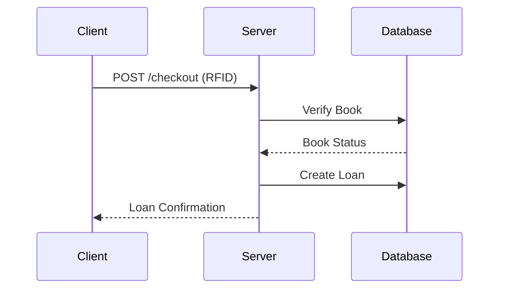

# 🏛️ Modern Smart Library System - Backend API

![System Architecture]

## Class Diagram
📄 [Download Library Manual (PDF)](frontend/public/Docs/ClassDiagram.pdf)

📄 [View PDF on GitHub](https://github.com/Aboubaker001/Univ-Library/blob/master/frontend/public/Docs/ClassDiagram.pdf)


A high-performance backend for smart library management with RFID tracking, automated workflows, real-time analytics, and robust API design.

---

## 🚀 Quick Start

### ✅ Prerequisites
- **Node.js** 18+
- **PostgreSQL** 14+
- **Redis** (for caching and sessions)

```bash
# Clone the project
git clone https://github.com/yourrepo/library-backend.git
cd library-backend

# Install dependencies
npm install

# Setup environment
cp .env.example .env
nano .env  # Configure database, Redis, JWT, etc.

# Run DB migrations
npm run migrate

# Start development server
npm start
```

---

## 🔁 Checkout Flow



---

## 🧩 Database Schema

```sql
-- Users Table
CREATE TABLE users (
  user_id UUID PRIMARY KEY DEFAULT gen_random_uuid(),
  email VARCHAR(100) UNIQUE NOT NULL,
  password_hash VARCHAR(255) NOT NULL,
  role VARCHAR(20) CHECK (role IN ('student', 'librarian', 'admin'))
);

-- Books Table
CREATE TABLE books (
  isbn VARCHAR(20) PRIMARY KEY,
  title VARCHAR(255) NOT NULL,
  status VARCHAR(20) CHECK (status IN ('available', 'checked_out', 'reserved'))
);
```

---

## 🔐 Authentication

### POST `/auth/login`

**Request:**

```json
{
  "email": "user@library.edu",
  "password": "securepassword"
}
```

**Response:**

```json
{
  "token": "eyJhbGciOiJIUzI1NiIs...",
  "user": {
    "email": "user@library.edu",
    "role": "student"
  }
}
```

---

## 📦 Sample Logic: Checkout Controller

```js
// controllers/checkout.js
async function handleCheckout(req, res) {
  const { rfidTag } = req.body;
  
  const book = await BookItem.findOne({ 
    where: { rfid_tag: rfidTag, status: 'available' },
    lock: true
  });

  if (!book) throw new Error('BOOK_UNAVAILABLE');
  
  const loan = await Loan.create({
    bookId: book.id,
    userId: req.user.id,
    dueDate: calculateDueDate(req.user.role)
  });

  await book.update({ status: 'checked_out' });
  res.json(loan);
}
```

---

## 💸 Fine Calculation Service

```js
// services/fineService.js
function calculateFine(loan) {
  const daysLate = Math.ceil((Date.now() - loan.dueDate) / (1000 * 60 * 60 * 24));
  return Math.min(daysLate * 1.50, 25.00); // $1.50/day, max $25
}
```

---

## 🛡️ Security Middleware

```js
// middleware/security.js
app.use(helmet());

app.use(rateLimit({
  windowMs: 60 * 1000,  // 1 minute
  max: 100              // limit each IP
}));
```

---

## 🧪 Tests (Jest + Supertest)

```bash
npm test
```

```js
test('Prevent student over-borrowing', async () => {
  await Loan.bulkCreate(testLoans(5)); // Max loans = 5

  const res = await request(app)
    .post('/checkout')
    .set('Authorization', `Bearer ${studentToken}`);
  
  expect(res.status).toBe(400);
});
```

---

## 🐳 Docker Setup

```Dockerfile
FROM node:18-alpine

WORKDIR /app
COPY package*.json ./
RUN npm ci --only=production
COPY . .
EXPOSE 3000

CMD ["node", "server.js"]
```

---

## ☸️ Kubernetes Deployment

```yaml
apiVersion: apps/v1
kind: Deployment
metadata:
  name: library-api
spec:
  replicas: 3
  template:
    spec:
      containers:
      - name: app
        image: yourrepo/library-api:1.0.0
        ports:
        - containerPort: 3000
```

---

## 🌟 Key Features

- 📚 **RFID Book Tracking** – Touchless checkout/return
- ⚡ **Real-Time Analytics** – See book traffic live
- 🔒 **Role-Based Access** – Admin, librarian, student
- 🛡️ **Security-First** – Rate limiting, Helmet, JWT
- 🧪 **Well-Tested** – Jest + Supertest + CI-ready
- 🐳 **Containerized** – Docker + Kubernetes compatible

---

## 📘 How to Use This README

1. Save as `README.md` in your project root
2. Push to GitHub/GitLab for live preview
3. Convert to PDF via:
   - [Markdown to PDF](https://www.markdowntopdf.com/)
   - Or VS Code ➝ *Markdown PDF* extension

---

## 📌 Suggestions (Optional)

Would you like to include:
- 📊 Load testing results?
- 🔖 API versioning strategy?
- 🩺 Monitoring/Health checks setup?
- 📬 Notification integrations (email/SMS)?

Let me know and I’ll append the section accordingly!